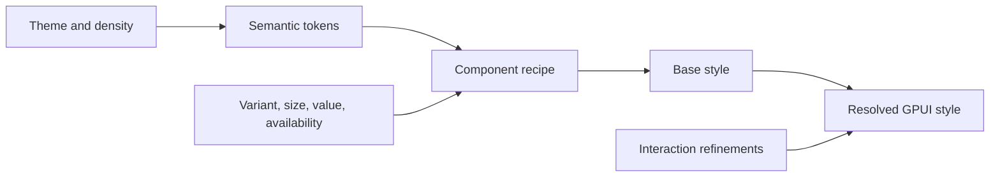

# Styling, tokens, and themes

Read before implementing visual styling, typography, theme changes, or interaction refinements. APIs refer to the [source baseline](gpui-sources.md).

## Style values and fluent methods

`Styled::style(&mut self)` returns an element's `StyleRefinement`. Fluent methods write its fields; repeated writes to the same base property replace the earlier value. `Style` is the resolved style; a refinement represents partial overrides. `StyleRefinement` also implements `Styled`, which is why state callbacks can use the same styling vocabulary. Nested refinements merge their supplied fields. [Styled](https://github.com/zed-industries/zed/blob/95cd535a5fad96d649513f96c5784ceefd379e47/crates/gpui/src/styled.rs), [style types](https://github.com/zed-industries/zed/blob/95cd535a5fad96d649513f96c5784ceefd379e47/crates/gpui/src/style.rs)

| Concern | Representative API |
| --- | --- |
| Layout | `flex`, `grid`, `flex_col`, `items_center`, `justify_between` |
| Constraints | `w`, `h`, `min_w`, `max_w`, `flex_1`, `flex_shrink_0` |
| Spacing | `p`, `px`, `py`, `m`, `gap` and numbered utilities |
| Surface | `bg`, `border_1`, `border_color`, `rounded_md`, `shadow`, `opacity` |
| Text | `text_color`, `text_size`, `font_family`, `font_weight`, `line_height` |
| Text overflow | `whitespace_nowrap`, `truncate`, `line_clamp` |
| Visibility | `hidden`, `invisible`, `visible` |

Many sizing, spacing, border, and shadow utilities are macro-generated. Look in the [style macros](https://github.com/zed-industries/zed/blob/95cd535a5fad96d649513f96c5784ceefd379e47/crates/gpui_macros/src/styles.rs) when a method is absent from `styled.rs`. Use `gpui::prelude::*` to bring the traits into scope.

## Units and scaling

`px(...)` supplies logical pixels; `DevicePixels` describes physical display pixels. `rems(...)` resolves against `Window::rem_size()`, which `set_rem_size(...)` can change. `relative(...)` expresses a fraction interpreted by the receiving property. It is not interchangeable with an absolute length. [Geometry units](https://github.com/zed-industries/zed/blob/95cd535a5fad96d649513f96c5784ceefd379e47/crates/gpui/src/geometry.rs), [window scaling](https://github.com/zed-industries/zed/blob/95cd535a5fad96d649513f96c5784ceefd379e47/crates/gpui/src/window.rs)

At the baseline, `p_4()` is 1 rem, `gap_2()` is 0.5 rem, and `rounded_md()` is 0.375 rem. Their apparent pixel values depend on the window's rem size. Border utilities such as `border_1()` use pixels. [Generated scales](https://github.com/zed-industries/zed/blob/95cd535a5fad96d649513f96c5784ceefd379e47/crates/gpui_macros/src/styles.rs)

**Design-system guidance:** choose token units deliberately. Use scalable lengths for spacing, typography, and controls that should follow UI zoom; use logical pixels for dimensions intended to remain fixed. Treat density, text scaling, and display scale as separate inputs. Exercise all three before relying on measured row heights.

## Inheritance

GPUI is a Rust element system with CSS-inspired layout and helpers. General box properties do not cascade from parent to child. Text styles are applied through a window text-style stack while descendants are laid out and painted; descendant text refines the inherited text style. Set root typography and foreground at a deliberate boundary. [Style types](https://github.com/zed-industries/zed/blob/95cd535a5fad96d649513f96c5784ceefd379e47/crates/gpui/src/style.rs), [window text stack](https://github.com/zed-industries/zed/blob/95cd535a5fad96d649513f96c5784ceefd379e47/crates/gpui/src/window.rs)

Icons are a special case: see [SVG primitives](gpui-primitives.md#icons-images-and-assets) for explicit tinting.

## Interaction refinements

At the baseline, the div's style is resolved in this order; later supplied fields win:

1. Default style and base refinement.
2. `in_focus`, `focus`, then `focus_visible`.
3. Group hover, then element hover, when drag/touch conditions permit.
4. Group drag-over, then element drag-over.
5. Group active, then element active.

`in_focus` means inside the focused element (or itself focused), rather than a focus-within test for a focused descendant. `focus_visible` checks focus and keyboard modality. `hover` is stored as a single refinement; calling it twice triggers a debug assertion at this baseline. Combine all hover properties in one closure. [Style resolution](https://github.com/zed-industries/zed/blob/95cd535a5fad96d649513f96c5784ceefd379e47/crates/gpui/src/elements/div.rs), [focus containment](https://github.com/zed-industries/zed/blob/95cd535a5fad96d649513f96c5784ceefd379e47/crates/gpui/src/window.rs)

**Design-system guidance:** reserve the focus-indicator properties so hover and active refinements preserve them. Resolve selected/checked/expanded values separately from transient interaction refinements. Define availability and loading behavior using [Interaction](gpui-interaction.md), then apply the corresponding appearance.

## Token resolution

**Design-system guidance:** maintain this direction of dependency:



A palette is a source of values. Semantic tokens express roles such as surface, on-surface text, subtle border, focus indicator, and disabled foreground. A recipe resolves these roles for a variant and size. Components should consume those roles rather than select raw palette entries independently.

Pair foreground tokens with the surfaces they are designed for, including hover, selection, and disabled combinations. Validate contrast in each supported theme and preserve meaning when color perception differs; status components should carry text or icon meaning as well as color.

A small illustration of explicit token application follows. It is an API shape, not compiled project code or a selected token scale:

```rust
use gpui::{div, prelude::*, Hsla, Rems};

struct SurfaceTokens {
    background: Hsla,
    foreground: Hsla,
    border: Hsla,
    padding: Rems,
    radius: Rems,
}

fn surface(tokens: &SurfaceTokens, body: impl IntoElement) -> impl IntoElement {
    div()
        .bg(tokens.background)
        .text_color(tokens.foreground)
        .border_1()
        .border_color(tokens.border)
        .p(tokens.padding)
        .rounded(tokens.radius)
        .child(body)
}
```

## Theme ownership and updates

GPUI supplies typed globals through `Global`, `set_global`, `global`, and global observers. It does not supply this project's semantic token vocabulary. `global<G>()` requires initialization; global updates notify registered observers. [Application globals](https://github.com/zed-industries/zed/blob/95cd535a5fad96d649513f96c5784ceefd379e47/crates/gpui/src/app.rs)

**Design-system guidance:** use an application global if one theme applies to the app; pass a theme/token snapshot explicitly when windows or previews need independent appearances. Decide this before designing theme accessors. Initialize before first render, read current values during rendering, and retain observers that call `cx.notify()` for consuming views. Verify that theme changes redraw existing and cached content. Theme updates may also invalidate typography and list measurements.

Zed's `cx.theme()`, `h_flex()`, and button helpers belong to its UI/theme layers. Treat them as examples of a design system built above GPUI, rather than methods available from GPUI alone. [Zed button composition](https://github.com/zed-industries/zed/blob/95cd535a5fad96d649513f96c5784ceefd379e47/crates/ui/src/components/button/button_like.rs)
